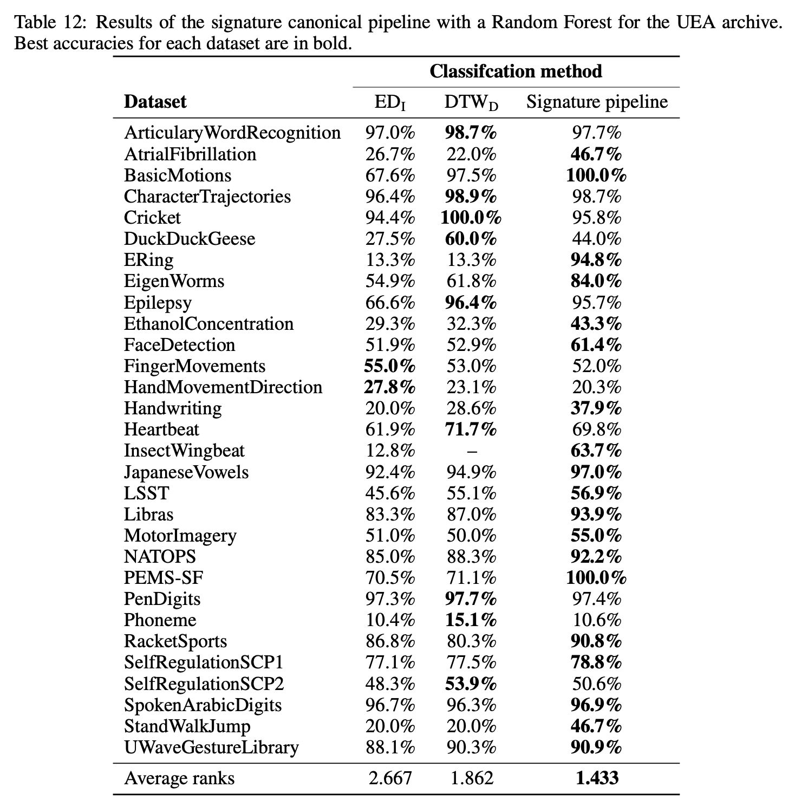

<h1 align='center'>A Generalised Signature Method for Time Series<br>
    [<a href="https://arxiv.org/abs/2006.00873">arXiv</a>] </h1>
<p align="center">
</p>

The signature method is a feature extraction technique for time series classification. Variations on the method exist as many authors have proposed modifications to it, so as to improve some aspect of it. Here, we introduce the *generalised signature method* that collates these variations together, gives an extensive overview of the literature to date, and groups them conceptually into:
+ **Augmentations** - Transformation of an input sequence or time series into one or more new sequences, so that the signature will return different information about the path.
+ **Windows** - Windowing operations, so that the signature can act with some locality.
+ **Transforms** - The choice between the signature or the logsignature transformation.
+ **Rescalings** - Method of signature rescaling.

This is summarised neatly below:

<p align="center">
    
</p>

where `phi_k` describes the augmentations, `W^{i, j}` the windowing operation, `\rho_{pre/post}` the scaling pre or post signature transform, and finally `S^N` the signature transform of choice. We refer to this procedure as *the generalised signature method*.

Through extensive empirical experiments we develop a canonical signature pipeline that represents a best-practices domain-agnostic starting point for the signature method.

----
## The code
This code provides a framework for running experiments over the huge array of different options, as laid out in the paper, for (in principle) any time series classification problem. We give examples on how to setup and build your own experiments in the `experiments` folder. The results of any runs are stored in `results` and there are some notebooks in `notebooks/examples` explaining how best to analyse them. 

One can even save the full model pipeline in a simple dill format. The saved model will be an sklearn pipeline that contains all the steps (as listed above) to make model predictions. 

## Results
As taken from the paper, we advise the following: 
1. Unless the problem is known to be translation or reparameterisation invariant, then use the time and basepoint augmentations. Basepoint and invisbility-reset augmentations produce essentially the same performance, so basepoint is recommended over invisibility-reset due to its lower computational cost, as it does not introduce an extra channel.
2. The lead-lag augmentation should be considered, but we do not recommend it in general. This is because the performance improvement it offers is relatively slight, and it is an expensive augmentation, due to its doubling of the number of pre-signature channels; recall that the number of signature features scales according to O(d^N), where d is the input channels and N is the depth of the (log)signature.
3. Use hierarchical dyadic windows, and the signature transform; both have a depth hyperparameter that must be optimised.

We give the results from this pipeline on the extensive [UEA repository](http://www.timeseriesclassification.com/) below:

<p align="center">
    
</p>

## Citation

```bibtex
@misc{morrill2020generalised,
    title={A Generalised Signature Method for Time Series},
    author={James Morrill and Adeline Fermanian and Patrick Kidger and Terry Lyons},
    year={2020},
    eprint={2006.00873},
    archivePrefix={arXiv},
    primaryClass={cs.LG}
}
```

----
## Reproducing the experiments
Here we give the steps to reproducing the results of the paper.

### Setting up the environment
+ dill==0.3.1.1
+ matplotlib==3.1.2
+ networkx==2.2
+ numpy==1.18.1
+ pandas==0.25.3
+ sacred==0.8.1
+ scipy==1.4.1
+ seaborn==0.9.0
+ six==1.14.0
+ skorch==0.7.0
+ sktime==0.3.1
+ torch==1.3.0
+ torchaudio==0.3.1
+ tqdm==4.41.1
+ signatory==1.1.6.1.3.0    [This must be installed _after_ PyTorch]

This can be done conveniently via:
+ `pip install -r requirements.txt`
+ `pip install signatory==1.1.6.1.3.1 --no-cache-dir --force-reinstall`
(Signatory has to be installed after PyTorch, so it's done separately.)

Additionally we require the directory root to be part of the Python path. On Linux then this can easily be done with the following commands:
+ `cd $(python -c "from distutils.sysconfig import get_python_lib; print(get_python_lib())")`
+ `printf "ROOT_DIR" > ./add_sources.pth` where `ROOT_DIR` is something like `/home/user/Documents/generalised-signature-method`.
See [here](https://stackoverflow.com/questions/4757178/how-do-you-set-your-pythonpath-in-an-already-created-virtualenv/47184788#47184788) for more instructions on how to do this.


### Getting the data
First create a directory in the root directory `data/`. Make this a symlink if space is a concern as all the data will be stored here. Additionally make a folder at `data/raw/`.

Scripts for getting the data are given in `get_data`. Simply run each of the following commands:
+ `python get_data/uea.py` (Note this takes about half an hour.)
+ `python get_data/human_activity.py`
+ `python get_data/speech_commands.py`


### Running the experiments
All experiments are run through the `experiments/main.py` script. The run configurations that were used for the results seen in the paper are given in `experiments/dicts/configurations.py` and the parameter grids are all given in `experiments/dicts/grids.py`.

A command line interface has been set up for running experiments through this script. The syntax is as follows:
`python main.py -c <arg1> -ds <arg2> [-e <arg3>] [-j <arg4>] [-r] [-s]`

Where:
+ `<arg1>` must be a key from the `config` variable in the `experiments/dicts/configurations.py`. The experiment will then run every option combination over that configuration grid. 
+ `<arg2>` must be a list of dataset names to run the experiment over. These must be the names of folder that exist in `data/processed`. For example `-ds SpeechCommands PenDigits ERing`. One can also setup key, value pairs in `experiments/dicts/data_dicts.py` and give the key as an argument to run over a list of datasets for example the keyword `all` will run over every dataset that exists in `data/processed`. 
+ `<arg3> (optional)` is the name of the experiment. This will be the name of the folder in `results` where the runs will be saved to. This can be left unspecified and will default to the name of the configuration key.
+ `<arg4> (optional)` the number of parallel processes to run the experiment over. More details are given below but this will call GNU parallel and parallelise over the datasets and configurations. Defaults to 1.
+ `-r (optional)` is given so that runs can be stopped and restarted (this is very useful for running long experiments that could crash). It is False by default as a precautionary measure: if you have not cleared out a folder after an old run and then run a new one, then a `-r` flag would continue to write files that would get muddled with the old runs. Defaults to False and will raise an error if the folder exists.
+ `-s (optional)` pass this flag to save the trained model pipelines in the run folder. Only recommended if you know you wish to use the trained model, else will start taking up a lot of memory over lots of runs. Defaults to False.

#### Examples
+ `python experiments/main.py -c learnt_augs -ds EigenWorms SpeechCommands` Will run the 'learnt_augs' configuration for the 'EigenWorms' and 'SpeechCommands' datasets. By not specifying the `-e` flag, the models will be saved in `experiments/results/learnt_augs`.
+ `python experiments/main.py -c random_projections -ds all -e my_new_rps` Runs the 'random_projections' configuration for all datasets that currently exist in `data/processed/` and saves to `experiments/results/my_new_rps`.
+ `python experiments/main.py -c random_projections -ds all -e my_new_rps -r` Suppose the previous run had to be stopped at some point before completion, specification of the `-r` flag means the model will only run for runs that have been marked as completed. 

#### Reproducing the experiments 
To reproduce the results used in the paper, simply run for each dataset (`-ds all` flag) for each key in the `configs` dictionary in `experiments/dicts/configurations.py`. So the command would be:
+ `python experiments/main.py -c <arg1> -ds all -j <arg2>` for every value of `<arg1>` in `baseline`, `depth_sig`, `best_rf`, `non-learnt_augs`, `disintegrations_augs`, `learnt_augs`, `linear_learnt_augs`, `random_projections`, `window`, `rescaling_and_norm` and `<arg2>` specifying the number of CPUs to run on. 

### Outputting model pipelines
Trained models can be easily saved as dill files and deployed to be used on new data. The internals of the pipeline contain all the steps necessary to run the full signature pipeline, from augmentation to classification. To save a model simply add a `-s` flag to the experiment run. For example
+ `python main.py -ds EigenWorms -c best_rf -e my_new_model -s` This will train a classifier for each of the options of the 'best_rf' configuration and save it in the run folder that will be located in `experiments/results/my_new_model`. 

### Model evaluation
Experiment results are continually logged in `experiments/results/<experiment-name>`. To extract the results into a dataframe see the examples in `notebooks/examples`.
